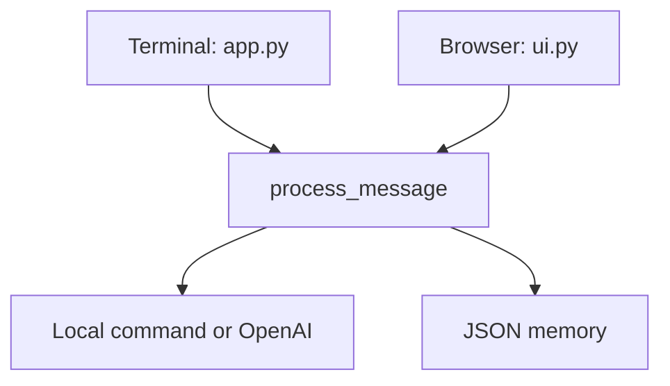

# Trevoxia Assistant

Trevoxia Assistant is a learning project for building an AI assistant one
working feature at a time. The current version is a local prototype with a
terminal interface, a Streamlit browser interface, OpenAI-generated responses,
and JSON-backed conversation memory.

> Current status: functional learning prototype. It is not production-ready.

## Latest completed lesson

**Week 1, Day 4 — Streamlit Browser Chat Interface**

Latest application commit: [`9f2c9c0`](https://github.com/brainox/trexovia-assistant/commit/9f2c9c0)

This checkpoint added:

- a Streamlit browser chat;
- shared message processing for the terminal and browser;
- persistent conversation history;
- clear-history controls;
- separate user and assistant message counts; and
- tests for the shared chat workflow.

## What currently works

- Start a conversation from the terminal.
- Start a conversation from a browser.
- Send unknown messages to an OpenAI model.
- Handle `hello`, `hi`, `help`, and `history` locally.
- Remember messages in `data/history.json` between application restarts.
- Send up to the ten most recent saved messages to the model as context.
- Clear memory with `clear`, `clear history`, or the browser button.
- Display separate user and assistant message counts in the browser sidebar.
- Test model integration without making live API requests.

## How the current application works



`process_message()` is the shared workflow. It handles memory clearing or
generates a reply, records the complete conversation turn, and saves the updated
history. This prevents the terminal and browser from implementing different
conversation rules.

## Project structure

```text
trexovia-assistant/
├── app.py
├── llm.py
├── memory.py
├── ui.py
├── requirements.txt
└── tests/
    ├── __init__.py
    ├── test_app.py
    ├── test_chat.py
    ├── test_llm.py
    └── test_memory.py
```

| File | Current responsibility |
| --- | --- |
| `app.py` | Local commands, shared message processing, and terminal interface |
| `llm.py` | OpenAI Responses API request and recent-context construction |
| `memory.py` | Load, append, and save JSON conversation history |
| `ui.py` | Streamlit browser interface and memory controls |
| `tests/` | Offline tests for replies, workflow, model requests, and memory |

## Requirements

The current learning environment uses:

- Python 3.9.6
- OpenAI Python SDK 2.48.0
- python-dotenv 1.1.1
- Streamlit 1.50.0

Streamlit is pinned to 1.50.0 because the project currently runs on Python
3.9.6. Newer Streamlit releases may require a newer Python version.

## Setup

Clone the repository and enter the project directory:

```bash
git clone https://github.com/brainox/trexovia-assistant.git
cd trexovia-assistant
```

Create and activate a virtual environment:

```bash
python3 -m venv .venv
source .venv/bin/activate
```

Install the pinned dependencies:

```bash
python -m pip install -r requirements.txt
```

Create a `.env` file in the project root:

```env
OPENAI_API_KEY=replace_with_your_api_key
OPENAI_MODEL=replace_with_a_model_available_to_your_account
```

Do not commit `.env`. It is excluded by `.gitignore`.

## Run the terminal assistant

Start the command-line interface:

```bash
python app.py
```

Available local commands:

| Command | Result |
| --- | --- |
| `hello` | Returns the saved greeting |
| `hi` | Returns the saved greeting |
| `help` | Lists the supported local commands |
| `history` | Returns the most recent user message |
| `clear` | Clears persistent conversation history |
| `clear history` | Clears persistent conversation history |
| `exit` | Stops the terminal application |

Messages that do not match a local command are sent to the configured OpenAI
model.

## Run the browser assistant

Start the Streamlit interface:

```bash
python -m streamlit run ui.py
```

The browser interface currently provides:

- user and assistant chat bubbles;
- restored JSON conversation history;
- a thinking indicator during model requests;
- user and assistant message counts;
- a clear-history button; and
- a visible error message when response generation fails.

## Conversation memory

Development conversation history is stored locally in:

```text
data/history.json
```

Each saved message has a role and content:

```json
{
  "role": "user",
  "content": "Explain an API"
}
```

The history file is excluded from Git because it can contain private
conversation data.

## Verification

Compile every current Python file:

```bash
python -m compileall -q app.py llm.py memory.py ui.py tests
```

Run the complete offline test suite:

```bash
python -m unittest discover -s tests -v
```

Current expected result:

```text
Ran 12 tests

OK
```

The tests use fake model clients and injected functions where appropriate, so
the offline suite does not require API credits. A live model request must be
verified separately using the API key and model configured in `.env`.

## Current limitations

- Conversation history uses one local JSON file.
- The application supports one local user and one conversation history.
- Stored messages are not encrypted.
- There is no authentication or user account system.
- There are no external tools, document retrieval, Gmail, or Calendar
  integrations.
- There is no background workflow engine.
- There is no deployment, centralized logging, or production monitoring.
- Automated tests do not make a live OpenAI request.

## Security notes

- Never place an API key directly in Python source code.
- Never commit `.env` or `data/history.json`.
- Revoke and replace any API key exposed in source control, screenshots, or
  messages.
